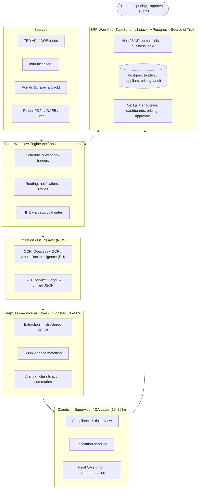
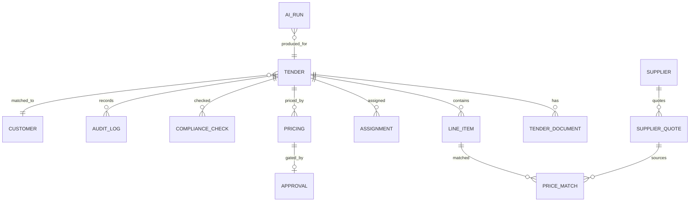

# Evertrust AI Tender-Operations ERP — Build Plan

**Status:** Draft v1 · **Date:** 2026-05-30 · **Owner:** Evertrust
**Source spec:** `Evertrust_Full_AI_Operations_Architecture.pdf` (DeepSeek × Claude × n8n × ERP)

This plan turns the architecture PDF into a buildable system. Decisions locked for this revision: **TypeScript full-stack**, **Next.js (App Router) frontend**, **ERP core built first**, **self-hosted (Docker/VPS)**. Research has been folded in and, where the PDF was technically inaccurate, this plan corrects it (see §2).

---

## 1. Goal & guiding principle

Build a scalable, GDPR-compliant tender-operations engine that lets Evertrust process **2–3× more tenders** with less repetitive manual work and lower AI cost.

**Principle (unchanged from the PDF):** AI removes repetitive operational work; humans keep the judgment calls — pricing, supplier selection, customer relationships, compliance acceptance, and final submission.

**Success criteria (how we'll know it works):**

- A new tender flows from *detected* → *parsed to structured line items* → *priced draft* → *human-approved* → *submission package* with no manual re-keying of data.
- Every AI output is logged with model, cost, and confidence; the DeepSeek/Claude split is measurable against the 70–90% / 10–30% target.
- No German tender or personal data is processed outside the EU.
- Pricing, eligibility, and compliance logic is deterministic, testable TypeScript — not prompt output.

---

## 2. Corrections to the source architecture (read this first)

Research surfaced five issues in the PDF that change the design. These are not cosmetic.

| # | PDF says | Reality | What we do instead |
|---|----------|---------|--------------------|
| 1 | "DeepSeek handles OCR" | **The DeepSeek text API cannot read images/PDFs.** It is text-only; "V4 Vision" is unverified marketing. | Add an explicit **OCR/ingestion stage *before* DeepSeek** (self-hosted **DeepSeek-OCR** model, or **Azure Document Intelligence** EU region). DeepSeek's job starts at *text*. |
| 2 | Uses `api.deepseek.com` | **DeepSeek's API is China-hosted** and under EU/German regulatory scrutiny — sending German tender/personal data there is a GDPR violation. | Run DeepSeek via **EU-region Azure AI Foundry** or **self-host the open-weights model in EU infra** (vLLM/Ollama). Models are MIT-licensed, so this is straightforward. |
| 3 | "Scribe parses GAEB X83" implies X83 = the bill of quantities | **X83 = *Angebotsaufforderung*** (the LV *plus empty price placeholders*, meant to be returned as **X84**). X81 is the unpriced LV. Current standard is **GAEB DA XML 3.3 (2021)**, not 3.2. | Model the **X83 → X84** pair as first-class. Validate that every mandatory position is priced before submission (empty fields = formal-exclusion risk). |
| 4 | "Scrape ibau/evergabe hourly" as the main intake | German portals are **protected databases** (sui-generis DB right, §87b UrhG). Systematic scraping is legally risky. | **Feeds before scraping:** primary source = **TED API** (EU, anonymous REST + eForms) and **Datenservice Öffentlicher Einkauf** (German federal aggregation); **licensed ibau** feed; portal scraping only as a throttled, ToS-respecting fallback. |
| 5 | GAEB parsing implied inline | No mature Node/TS GAEB parser exists; GAEB has 3 format generations and a complex price model. | Stand up a **dedicated GAEB normalization service** (self-hosted **Dangl.GAEB .NET** behind an internal HTTP/JSON endpoint, or AVACloud SaaS if residency allows) that returns unified JSON line items. |

**Net effect:** the "4-layer" model becomes a **5-layer** model — an **Ingestion/OCR layer** is inserted between raw documents and the DeepSeek worker layer.

---

## 3. System architecture

### 3.1 Layers



### 3.2 Layer responsibilities

- **ERP + Postgres — source of truth.** All tenders, suppliers, customers, pricing history, statuses, audit logs, compliance records. The web-app's NestJS backend owns all *deterministic* logic (eligibility rules, price math, validation). Postgres is the single source of truth; everything else is stateless around it.
- **Ingestion / OCR layer (new).** Converts raw documents into text/structured JSON: OCR for scanned PDFs/images, the GAEB service for X8x files, table/Excel extraction. Nothing reaches DeepSeek until it is text.
- **DeepSeek — worker layer (target 70–90% of AI volume).** High-volume *text* work: field extraction (strict-mode function calling → JSON schema), supplier price matching, classification, summarization, draft generation. EU-hosted. Cheap and parallel.
- **Claude — supervisor/QA layer (10–30%).** Activates on low confidence, red flags, compliance-sensitive or legally ambiguous items: risk review, contradiction detection, exclusion-criteria validation, escalation, final QA sign-off recommendation.
- **n8n — workflow engine.** Triggers (hourly scrape cron, webhooks), routing, notifications, retries/error workflows, and human-in-the-loop wait gates. **Thin orchestration only** — no business logic (project rule, AGENTS.md Rule 5).

### 3.3 Model-split policy (deterministic router)

A small TypeScript **routing policy** — *not* an LLM — decides who handles each task:

- Default every bulk text task to **DeepSeek V4-Flash** (cheapest workhorse).
- Escalate to **Claude** when: extraction confidence < threshold, pricing flag = **Red**, document is compliance-sensitive, or a legal-ambiguity heuristic trips.
- Use **DeepSeek V4-Pro** only for harder reasoning the Flash model fails on.
- Every run writes an `ai_run` record (model, tokens, € cost, confidence, escalated?) so the 70/30 split and spend are *measured*, not assumed.

---

## 4. Technology stack

| Concern | Choice | Why |
|---|---|---|
| Monorepo | **pnpm workspaces + Turborepo** | One repo, shared types, fast incremental builds. Matches `client/`+`server/` intent. |
| Backend API | **NestJS (Node/TS)** | Module/DI structure suits a domain-rich ERP; first-class validation, guards (RBAC), testing. |
| ORM / DB | **Drizzle ORM + PostgreSQL 16** | Type-safe SQL, easy migrations, no heavy runtime. Postgres = the spec's source of truth. |
| Frontend | **Next.js (App Router) + shadcn/ui + Tailwind + TanStack Query** | SSR + file routing + middleware auth, first-class shadcn; calls the NestJS API over HTTP. Matches installed `shadcn` / `frontend-design` skills. |
| Shared | **Zod schemas in `packages/shared`** | One source of truth for types *and* the JSON schemas DeepSeek extracts against. |
| Auth | **Auth.js / Lucia + RBAC** | Roles: PIC (L5), Pricing, Management, Admin. |
| Workflow | **n8n 2.0 (self-hosted, queue mode)** | Orchestration, scheduling, HITL gates. |
| AI — worker | **DeepSeek V4-Flash/Pro**, EU-hosted (Azure AI Foundry EU or self-host vLLM) | 70–90% of volume, near-zero token cost, GDPR-safe hosting. |
| AI — supervisor | **Claude (Haiku/Sonnet/Opus)** via Anthropic API | QA/compliance/escalation. |
| OCR | **DeepSeek-OCR (self-host GPU)** or **Azure Document Intelligence (EU)** | The missing layer; pick per volume/cost (see §7). |
| GAEB | **Dangl.GAEB .NET microservice** (self-host) or AVACloud | Robust GAEB→JSON across all format versions. |
| Infra | **Docker Compose** (later Kubernetes if needed), Traefik/Caddy TLS, Redis (n8n queue) | Self-hosted, reproducible. |
| Observability | **OpenTelemetry + Grafana/Loki**, structured logs | Trace AI runs, cost, errors. |

> **One self-hosted exception requiring a tiny non-TS service:** the GAEB parser is .NET (Dangl). It runs as an isolated container exposing JSON over HTTP; the rest of the system stays TypeScript.

---

## 5. Repository structure

```
evertrust-ERP/
├─ apps/
│  ├─ api/                 # NestJS backend (deterministic business logic, REST API)
│  └─ web/                 # Next.js (App Router) + shadcn/ui frontend
├─ packages/
│  ├─ shared/              # Zod schemas, shared types, DeepSeek extraction schemas
│  ├─ ai/                  # Model router, DeepSeek + Claude clients, prompt/eval harness
│  └─ db/                  # Drizzle schema, migrations, seed
├─ services/
│  ├─ ocr/                 # OCR service wrapper (DeepSeek-OCR or Azure DI client)
│  └─ gaeb/                # Dangl.GAEB .NET container → JSON
├─ infra/
│  ├─ docker-compose.yml   # app, postgres, n8n (main+worker), redis, traefik
│  ├─ n8n/                 # exported workflow JSON (version-controlled)
│  └─ otel/                # observability config
├─ tasks/                  # todo.md, lessons.md (project convention)
└─ docs/                   # this plan + ADRs
```

---

## 6. Data model (core entities)

The ERP core (Milestone 1) centers on these tables. Pricing/compliance tables come online in later milestones but are designed now to avoid rework.



Key tables (abbreviated):

- **tender** — `id`, `external_ref`, `source` (TED/DÖE/ibau/portal), `title`, `status` (enum: detected→qualified→open→pricing→approval→submitted→won/lost), `category/niche`, `regime` (VOB-A | VgV | UVgO), `location`, `budget`, `deadlines` (publication, questions, submission), `is_above_threshold`.
- **tender_document** — `tender_id`, `doc_class` (**TYPE1** incoming-to-price | **TYPE2** outgoing-to-submit), `kind` (LV/X83, X84, drawing, ZTV/spec, Formblatt-124, etc.), `storage_ref`, `ocr_status`, `parsed_ref`.
- **line_item** — `tender_id`, hierarchy (`title`/`section`/`position`), `short_text`, `long_text`, `quantity`, `unit`, `ep` (unit price), `gp` (total), `brand`, `standard`, `source_doc_id`.
- **supplier** / **customer** — CRM profile, niches, capabilities, quality/fit score, historical performance.
- **supplier_quote** / **price_history** — line-item ↔ supplier price, date, source (quote/ERP/old tender/Excel/catalog/email).
- **price_match** — `line_item_id`, `supplier_id`, `last_price`, `confidence`, `margin_estimate`, `ryg_flag` (Red/Yellow/Green), `references`.
- **pricing** — tender-level draft: subtotal, margin strategy, `final_price`, `decided_by`, status.
- **approval** — customer approval gate: `evidence_ref` (written approval), `approved_at`, `approved_by`. **Hard rule enforced in code: no written approval → no submission.**
- **assignment** — tender ↔ user (L5 PIC); inputs: current workload, niche expertise, historical performance, deadline pressure.
- **compliance_check** — `regime`, `s123_hard_gate` (pass/fail), `s124_flags[]`, `eignung_complete`, `missing_forms[]`, `reviewed_by`.
- **ai_run** — `tender_id`, `task_type`, `model`, `tokens_in/out`, `eur_cost`, `confidence`, `escalated`. Powers cost dashboard + 70/30 metric.
- **audit_log** — immutable append-only: actor (human or model), action, before/after, timestamp. Required for procurement defensibility.
- **kpi_snapshot** — win/loss, supplier scoring, profitability, cost-per-tender.

---

## 7. AI orchestration & cost control

### 7.1 Extraction contract

DeepSeek extracts against **Zod-derived JSON schemas** using **strict-mode function calling** (DeepSeek beta endpoint) so output is schema-valid by construction. The same Zod schema validates the result in TypeScript — one source of truth in `packages/shared`.

### 7.2 Escalation to Claude

Triggered by deterministic rules: `confidence < 0.8`, `ryg_flag = Red`, `regime requires above-threshold review`, compliance-sensitive position, or contradiction heuristics. Claude returns a structured review object (verdict, issues, recommendation) — never an auto-decision; a human still acts on it.

### 7.3 Cost model (validated, transparent)

DeepSeek tokens are effectively free; the real monthly cost is **OCR + Claude QA + infra**. The PDF's €300–700/mo is plausible *at low volume with cloud OCR and modest QA*, but climbs with page volume and Opus usage.

| Component | Low-volume estimate | Driver |
|---|---|---|
| DeepSeek worker tokens (V4-Flash) | €7–25/mo | Near-free even at ~1,000 tenders/mo |
| Claude QA (Sonnet/Haiku, ~15% of volume) | €30–150/mo | Model tier × % escalated — **biggest token lever** |
| OCR | **€10–65 per 1,000 pages** (Azure) *or* fixed **€300–1,000/mo GPU** (self-host DeepSeek-OCR) | Page volume vs. owning a GPU |
| App + n8n + Postgres VPS | €40–150/mo | Cores/RAM; queue mode wants ≥4 vCPU/8 GB |
| GAEB (Dangl) | AVACloud subscription *or* sunk self-host cost | Residency choice |
| **Realistic all-in (self-hosted)** | **~€400–1,200/mo** | Dominated by OCR approach + Claude QA share |

**Levers:** route aggressively to DeepSeek-Flash; cache repeated tender boilerplate (~10× input discount); self-host OCR once page volume is steady; reserve Opus for genuinely hard QA.

---

## 8. n8n workflow layer

**Boundary rule:** n8n orchestrates and notifies; the NestJS API decides. Workflows call ERP endpoints via HTTP Request; deterministic logic never lives in a Code node.

Core workflows (exported as version-controlled JSON in `infra/n8n/`):

- **Argus — intake poll** (Schedule Trigger, hourly): pull TED API / DÖE feeds, dedupe, download attachments, POST new tenders to the ERP; detect amendments/deadline changes.
- **Scribe dispatch** (Webhook from ERP on new document): route to OCR → GAEB service → DeepSeek extraction → write line items back.
- **Sieve notify** (Webhook): after the ERP's deterministic bid/skip rules run, send notifications and open the record.
- **Customer-approval gate** (Wait node, *On Webhook Call* + JWT): pause until the customer approves in the React UI; the ERP backend calls the resume URL; pending + decision state persisted in Postgres for audit. Reminder cadence T-5/T-3/T-1 via scheduled branches.
- **Error workflow** (Error Trigger): centralized failure logging into Postgres + operator notification surfaced in the ERP UI.

Production posture: **queue mode** (main + Redis + ≥1 worker + dedicated Postgres, *separate from the ERP DB*), pinned `n8n:2.0.x` image, Draft/Publish so live tender workflows aren't disturbed during edits.

---

## 9. Phase → feature mapping

The PDF's 8 phases map onto milestones (§10) like this:

| PDF phase | System feature | Primary layer | Milestone |
|---|---|---|---|
| 1 — Partner scouting | Supplier scraping/enrichment/scoring | DeepSeek + Claude eval | M8 (later; human-led) |
| 2 — Tender search & intake | Argus feeds + Scribe parse + Sieve rules | n8n + Ingestion + DeepSeek | M3 |
| 3 — Shortlist & client matching | Tender↔customer fit, ranking, outreach drafts | DeepSeek; human approves | M4 |
| 4 — Record open & assign | ERP record, tender ID, classify, auto-assign PIC | ERP core | M1/M4 |
| 5 — Pricing (most important) | Line-item extract → supplier match → R/Y/G → review | DeepSeek + Claude + human | M5 |
| 6 — Customer approval | Mandatory approval gate ("no written approval = no submit") | n8n wait + ERP | M6 |
| 7 — Docs + QC + submit | TYPE 2 assembly, completeness, §123/§124 compliance | DeepSeek + Claude; human submits | M6 |
| 8 — Result & follow-up | KPIs, win/loss, supplier scoring, analytics | DeepSeek + Claude | M7 |

---

## 10. Delivery plan (milestones)

Sequenced **ERP core first** (your choice). Each milestone ends with a verification gate; nothing is "done" until verified (AGENTS.md Rule 4/12). Effort is rough order-of-magnitude for a small team.

### M0 — Foundations (~1 week)
Monorepo (Turborepo/pnpm), Docker Compose (app, Postgres, n8n queue mode, Redis, Traefik), CI, env/secrets management, base auth skeleton.
**Verify:** `docker compose up` brings the full stack healthy; CI green; a seeded user can log in.

### M1 — ERP core ★ *first build* (~2–3 weeks)
Data model + migrations (all core tables), tender CRUD, supplier/customer registries, RBAC roles, **audit log**, the main dashboard (tender list, status board, detail view). Manual tender entry works end-to-end.
**Verify:** create→assign→advance a tender through statuses by hand; every change appears in the immutable audit log; RBAC blocks unauthorized actions; integration tests on state machine.

### M2 — Ingestion & parsing (~2–3 weeks)
Document upload + storage; OCR service (start with Azure DI EU or self-hosted DeepSeek-OCR); GAEB service (Dangl) → unified JSON; Scribe extraction (DeepSeek strict-mode) → `line_item` rows; X83→X84 model.
**Verify:** upload a real X83 + a scanned PDF → correct line items with quantities/units; round-trip an X84 with all mandatory positions priced; extraction accuracy spot-checked against ground truth.

### M3 — Intake automation / Phase 2 (~2 weeks)
Argus (TED API + DÖE feeds, ibau if licensed, scraping fallback) via n8n hourly schedule; dedupe + amendment/deadline detection; **Sieve** deterministic bid/skip rules (niche, blacklist, location, budget) in the API.
**Verify:** scheduled run ingests live tenders, dedupes correctly, applies rules; bid/skip decisions match a rules test suite; ToS/robots respected.

### M4 — Matching & assignment / Phases 3–4 (~2 weeks)
Tender↔customer fit scoring + ranking; outreach draft generation (human-approved before send); auto-assign PIC (workload/niche/performance/deadline); folder/record creation.
**Verify:** matching ranks a known case correctly; assignment respects workload caps; no outreach sends without human approval.

### M5 — Pricing engine / Phase 5 ★ *highest value* (~3–4 weeks)
Supplier price matching against history/ERP/old tenders/Excel/catalogs; AI output (closest match, last price, confidence, margin); **Red/Yellow/Green** flagging; Claude review of risky items; pricing workbench UI where humans set final price/margin/supplier.
**Verify:** price math is deterministic and unit-tested; R/Y/G flags fire on abnormal pricing/units/margins; Claude review attaches to red items; humans retain final-price control; diff against a historically priced tender.

### M6 — Approval + docs/QC/submit / Phases 6–7 (~3 weeks)
Customer-approval gate (n8n Wait + ERP UI, **no-approval-no-submit enforced in code**); reminder cadence T-5/T-3/T-1; TYPE 2 assembly; completeness/missing-form detection driven by a per-tender required-forms manifest; Claude compliance review (§123 hard gate, §124 flags, Eignung completeness); submission package + receipt archiving. Portal submission stays human.
**Verify:** submission is *impossible* without a recorded written approval; compliance check catches a seeded missing Formblatt-124 and a §123 trigger; package contents validated against manifest.

### M7 — Analytics / Phase 8 (~2 weeks)
KPI aggregation, win/loss stats, supplier scoring, profitability, and the **AI cost / 70-30 split dashboard**; Claude trend/loss-pattern analysis.
**Verify:** KPIs reconcile against raw records; cost dashboard matches actual provider invoices within tolerance.

### M8 — Partner scouting / Phase 1 (~2 weeks, later)
Supplier website scraping, CRM enrichment, niche classification, capability summaries; Claude strategic partner/risk evaluation. Human-led lane, lowest urgency.
**Verify:** enrichment accuracy spot-checked; no unsolicited outreach automated.

**Cross-cutting (every milestone):** security/GDPR, observability, eval harness for AI tasks, and `tasks/lessons.md` updates after any correction.

---

## 11. Security, GDPR & compliance

- **Data residency:** all AI inference and storage in the **EU**. DeepSeek via EU Azure or EU self-host; never `api.deepseek.com`. Document a Transfer Impact Assessment for any non-EU processor (e.g., Anthropic) and minimize/pseudonymize data sent.
- **Least privilege:** RBAC on every endpoint; secrets in a vault (n8n external-secrets supported); per-service network isolation in Compose.
- **Auditability:** immutable `audit_log` for every state change and AI decision — essential if a tender outcome is ever challenged before a *Vergabekammer*.
- **Procurement-law correctness (Claude QA layer):** detect regime (VOB/A for works, VgV/UVgO otherwise) with **runtime-updated thresholds** (don't hard-code 2026 values); **§123 as a hard gate**, **§124 + self-cleaning §125/§126 as human-review flags**; keep **Eignung (suitability)** and **Zuschlag (award)** strictly separate in the schema.

---

## 12. Risks & open decisions

| Risk / decision | Notes | Needed from you |
|---|---|---|
| **OCR approach** | Self-host DeepSeek-OCR (GPU cost, full control) vs. Azure DI (per-page, EU region). Drives cost + ops. | Expected page volume/month? |
| **DeepSeek hosting** | EU Azure AI Foundry vs. self-host vLLM (needs GPU). | Do you have/ want GPU infra, or prefer managed EU? |
| **GAEB licensing** | Dangl self-host (.NET, sovereign) vs. AVACloud SaaS (data leaves infra). | Is AVACloud's data handling acceptable, or self-host only? |
| **ibau feed** | Licensed commercial feed vs. scraping. Licensing is the low-risk route. | Existing ibau subscription? |
| **Submission automation** | XVergabe enables programmatic submission later; PDF keeps submission human. | Keep human-only for v1 (recommended). |
| **Model churn** | DeepSeek line moves fast (`deepseek-chat`/`reasoner` retire 2026-07-24). | Pin model names; re-verify pricing/regions quarterly. |
| **Team & timeline** | Milestone efforts assume a small team. | Team size / target go-live? |

---

## 13. Recommended next step

Approve this plan (or adjust §12 decisions), then I scaffold **M0 + M1** — the monorepo, Docker stack, data model, and ERP-core CRUD with audit logging — as the first working slice. From there each milestone is an independent, verifiable increment.

---

## Appendix — key sources

- DeepSeek API (models, pricing, JSON/function calling, residency): api-docs.deepseek.com; Microsoft Foundry; NVIDIA NIM; Claude pricing at platform.claude.com.
- DeepSeek-OCR: huggingface.co/deepseek-ai/DeepSeek-OCR.
- GAEB DA XML / phases / X83: gaeb.de, gaeb-online.de; Dangl AVACloud (`@dangl/avacloud-client-node`).
- Platforms & law: TED API (docs.ted.europa.eu), Datenservice Öffentlicher Einkauf (bescha.bund.de), GWB §123/§124 (cosinex/dejure), Schwellenwerte 2026, VHB Formblatt 124.
- n8n: docs.n8n.io (queue mode, Wait node, DeepSeek/Anthropic nodes, error handling), Sustainable Use License.
